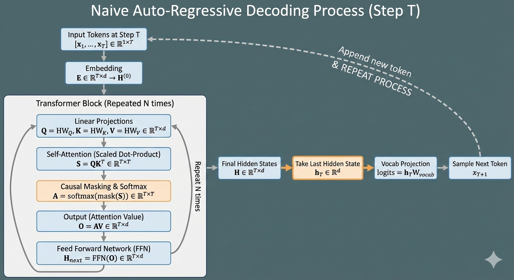

vLLM is one of the most influential modern LLM serving engines, best known for its efficient management of KV cache memory through a technique called PagedAttention. The key insight behind vLLM is that **the primary bottleneck in LLM serving today is no longer computation, but memory**—specifically **how KV cache is allocated, shared, and managed on GPUs**. PagedAttention draws inspiration from virtual memory systems in operating systems to address this problem.

Before diving into the vLLM paper itself, it is important to understand **KV caching**, because it **is the core mechanism being rethought and redesigned throughout the paper**.

## 1. KV Cache

#### 1.1 Naive Approach
In naive autoregressive decoding with Transformers, each new token is generated by reprocessing all previously generated tokens. At decoding step t, the model **recomputes the key and value vectors for tokens 1 through t**, even though those values were already computed in earlier steps. This results in **redundant computation that grows quadratically with sequence length**, making **long-context decoding extremely inefficient**.

||
|:--:| 
| *Image generated by Gemini* |

#### 1.2 Autoregressive Decoding With KV Cache
KV caching was introduced to eliminate this redundancy. Instead of recomputing keys and values at every decoding step, the model **stores the computed K and V vectors in memory and reuses them for subsequent steps**. During decoding, only the query corresponding to the newly generated token is computed, and attention is performed between this query and the cached keys and values. Although this **changes the attention computation from a GEMM into a matrix–vector** operation—which is less favorable for GPU utilization—the overall computation cost is significantly reduced because expensive KV recomputation is avoided. In practice, **the benefits of KV reuse far outweigh the loss in arithmetic intensity**.

||
|:--:| 
| *Image generated by Gemini* |

## 2. Challenges with KV Cache

#### 2.1 Large KV Cache
However, KV caching introduces a new and severe bottleneck: **memory usage**. The KV cache grows linearly with sequence length and must be stored for every active request. For example, in the OPT-13B model, each token requires storing both a key and a value vector across all layers. With a hidden size of 5120, 40 layers, and FP16 precision, a single token consumes approximately **800 KB of KV cache memory**. Since OPT supports sequences up to 2048 tokens, the KV cache for a single request can occupy **as much as 1.6 GB of GPU memory**. Even on modern GPUs with tens of gigabytes of VRAM, this **severely limits the number of concurrent requests** that can be served.

#### 2.2 Unsharable Cache
The problem becomes even more complex when considering modern decoding algorithms. LLM serving is not limited to greedy decoding; users often request **multiple sampled outputs from the same prompt** or use **beam search to retain multiple high-probability continuations**. In theory, these decoding strategies could share KV cache for the common prefix of the sequence. In practice, however, once the outputs diverge, their future tokens depend on different contexts and positions. Because most deep learning frameworks require tensors to be stored in contiguous memory, these **KV caches must be physically duplicated**, even when large portions are logically identical. This prevents effective memory sharing and leads to significant waste.

#### 2.3 Dynamic Length of Input and Output
Another fundamental challenge arises from the fact that both **input and output lengths are unknown at runtime**. Prompts vary widely in length, and generation can terminate at unpredictable times. Since the **KV cache grows dynamically as tokens are generated**, the memory management system must be able to accommodate expanding buffers. When GPU memory becomes exhausted mid-generation, the system must either reject new requests or stall existing ones. **Pre-allocating KV cache** buffers for the maximum possible sequence length avoids reallocation but **wastes enormous amounts of memory when sequences are shorter than the maximum**.

#### 2.4 Contiguous Memory Allocation
All of these issues stem from a core assumption shared by most deep learning frameworks: **tensors must be allocated in contiguous memory**. This assumption makes memory management simple but inflexible. 

||
|:--:| 
| *Fragmentation Example ( From the paper [vLLM](https://arxiv.org/pdf/2309.06180) )* |

This figure illustrates how internal and external fragmentation arise in traditional LLM serving systems. To handle unknown output lengths, systems pre-allocate KV cache slots for the maximum sequence length. As a result, many reserved slots are never used, causing **internal fragmentation**. At the same time, as requests with different prompt lengths start and finish at different times, free memory becomes scattered into small gaps between active allocations. These gaps cannot be reused effectively, leading to **external fragmentation**. Even though sufficient total memory exists, it cannot be used to serve new requests efficiently.

||
|:--:| 
| *Memory Wastes in Different LLM Servings ( From the paper [vLLM](https://arxiv.org/pdf/2309.06180) )* |

This bar chart quantifies how much KV cache memory is actually useful versus wasted in different serving systems. In Orca-based systems, **a large fraction of memory is lost** to internal fragmentation, reservation overhead, and external fragmentation, leaving only a small portion for actual token states. In contrast, **vLLM achieves near-optimal memory utilization**: over 96% of KV cache memory is used for real token states. Let's see how vLLM achieved this almost-perfect memory management.

## 3. vLLM : Rethinking Memory for LLM Serving
These limitations are precisely what motivate vLLM. By **removing the requirement that KV cache be stored contiguously** and instead **managing it in fixed-size blocks**—much like pages in a virtual memory system—PagedAttention enables efficient allocation, sharing, and reclamation of KV cache memory. This shift in perspective is what allows vLLM to **dramatically improve GPU memory utilization** and serve many more concurrent requests than previous systems.

||
|:--:| 
| *vLLM System Overview ( From the paper [vLLM](https://arxiv.org/pdf/2309.06180) )* |

We will refer back to this diagram later, but the key takeaway is that **the scheduler controls all global decisions** in vLLM. It determines request scheduling and KV cache management, while the KV Cache Manager maintains block mappings and allocators. **GPU workers are intentionally simple**: they only execute assigned computations using the provided physical KV block IDs, without making scheduling or memory management decisions themselves.

#### 3.1 PagedAttention
At first glance, PagedAttention sounds like a new attention algorithm. In reality, it is **much closer to a memory management system** than a change to the attention computation itself. The key idea is simple but powerful: instead of storing the KV cache as one large contiguous tensor, vLLM **breaks it into small fixed-size blocks** and manages them dynamically, much like pages in a virtual memory system.

During decoding at time step $t$, the Transformer computes attention using:

$$
\text{Attention}(Q_t, K_{1:t}, V_{1:t}) = \text{softmax}(\dfrac{Q_tK_{1:t}^T}{\sqrt{d}})V_{1:t}
$$

Here:
- $Q_t$ is the query vector for the newly generated token
- $K_{1:t}$ and $V_{1:t}$ are the cached keys and values from all previous tokens
- $d$ is the hidden dimension

With KV caching, $K_{1:t}$ and $V_{1:t}$ are not recomputed, but they are **assumed to be stored contiguously** in memory. This assumption is where the real problem begins as mentioned above.

To resolve the problems with traditional KV cache memory management system, PagedAttention divides the KV cache into fixed-size blocks, each containing KV vectors for a small number of tokens. For example, one block might store KV for 16 tokens.

Instead of indexing tokens by position directly, vLLM introduces a **logical-to-physical mapping**. Each request maintains a table that maps its logical sequence positions to physical blocks in GPU memory. These blocks can be:
- Allocated non-contiguously
- Reused across requests
- Released independently when no longer needed

This is directly **analogous to how virtual memory maps virtual pages to physical pages**.

With paged KV storage, the attention computation conceptually becomes:

$$
\text{Attention}(Q_t, \{K_{b}\}, \{V_{b}\})
$$

where $\{K_{b}\}, \{V_{b}\}$ are KV blocks corresponding to the sequence so far.

Internally, attention is computed block by block:

$$
\begin{aligned}
\alpha_b &= \dfrac{Q_t K_b^T}{\sqrt{d}} \\
\text{scores} &= \text{concat}(\alpha_1, \alpha_2, \dots) \\
\text{output} &= \text{softmax}(\text{scores}) \cdot \text{concat}(V_1, V_2, \dots)
\end{aligned}
$$

Crucially, the **mathematical result is identical to standard attention**. The only difference is that the keys and values are gathered from multiple physical locations instead of a single contiguous tensor.

PagedAttention therefore preserves correctness while **fundamentally changing memory behavior**.

||
|:--:| 
| *Simple PagedAttention Example ( From the paper [vLLM](https://arxiv.org/pdf/2309.06180) )* |

#### 3.2 KV Cache Manager
The KV Cache Manager is the **core component of vLLM**, and it is what allows vLLM to overcome the severe memory fragmentation problems found in previous LLM serving systems. Because PagedAttention stores the KV cache in small, fixed-size blocks, the KV cache can be managed in a way that closely resembles virtual memory in an operating system.

Just as an OS divides memory into fixed-size pages and maps a process’s virtual pages to physical memory pages, vLLM partitions GPU memory into fixed-size KV cache blocks and maintains a **mapping from logical blocks** (the token positions seen by the model) **to physical blocks** (actual locations in GPU DRAM). Through this indirection, logically contiguous KV cache can be backed by non-contiguous physical memory. As a result, vLLM can allocate KV cache space dynamically, **eliminating the need to pre-allocate memory** for the maximum possible sequence length—a practice that previously caused massive memory waste.

All of this functionality is implemented by the KV Block Manager, which maintains block tables that record the mapping between logical KV blocks and physical KV blocks.

||
|:--:| 
| *Logical-Physical Mapping Example ( From the paper [vLLM](https://arxiv.org/pdf/2309.06180) )* |

As illustrated in the figure, logical blocks remain contiguous from the model’s perspective, while their corresponding physical blocks may be scattered across GPU memory. The block manager also tracks how many tokens have been written into each block. When a block becomes full, a new block is allocated and appended to the logical sequence. This **enables KV cache to grow incrementally** as tokens are generated, without requiring reallocation or data copying. 

PagedAttention does introduce **a small amount of internal fragmentation**. Since blocks are fixed in size, the unused slots in the last block of a sequence are reserved for future tokens. However, this waste is strictly bounded by the block size and is negligible compared to earlier systems, which often reserved memory for thousands of tokens per request regardless of actual usage. In practice, this bounded fragmentation is a **small and acceptable trade-off** for dramatically improved memory utilization and scalability.

From the discussion so far, it might appear that blocks cannot be shared across requests. Since each KV block reserves unused space for future tokens, one could mistakenly conclude that blocks must remain private to each request, preventing any form of sharing.

||
|:--:| 
| *Two Simultaneous Requests ( From the paper [vLLM](https://arxiv.org/pdf/2309.06180) )* |

At first glance, the figure seems to support this interpretation: each request appears to own its own sequence of blocks, with unused slots reserved for upcoming tokens. If this were truly the case, vLLM would fail to address the core challenges discussed earlier—namely excessive memory usage, duplication of KV cache for shared prefixes, and poor scalability under high concurrency.

#### 3.3 Complex Decoding Algorithm

As discussed in Section 2.2, many decoding algorithms share a common prefix. If their KV caches could also be shared, memory redundancy would be dramatically reduced. vLLM addresses this elegantly by **introducing reference counting for KV blocks**.

Consider parallel sampling, where multiple outputs are generated from a single input prompt. Since all samples start from the same prompt, their KV cache for the prompt tokens is identical. During the prefill stage, vLLM exploits this by mapping all samples to the same physical KV blocks that store the prompt’s keys and values.

||
|:--:| 
| *Parallel Sampling Example ( From the paper [vLLM](https://arxiv.org/pdf/2309.06180) )* |

As shown in the figure, two samples initially reference the same physical block, and the block’s reference count is increased to 2. At this stage, the block is **read-only shared**: both samples can read from it, but neither can modify it.

As decoding continues, the samples begin to generate different tokens. This is where vLLM’s **copy-on-write mechanism** comes into play. When vLLM attempts to append a new KV value to a block whose reference count is greater than 1, it recognizes that the block is shared. To preserve correctness, vLLM allocates a new physical block, copies the contents of the original block into it, and appends the new KV entry to the newly allocated block. The reference count of the original block is then decremented, allowing the other sample to continue using it without interference.

This process ensures that KV blocks are **shared as long as possible and duplicated only when necessary**. Sharing is maximized for common prefixes, while divergence is handled safely and efficiently. As a result, vLLM avoids unnecessary KV duplication, significantly reducing memory usage under parallel sampling and other prefix-sharing decoding strategies.

Parallel sampling diverges immediately once decoding begins, since each sample independently generates its own next token. Beam search, however, behaves differently. In beam search, multiple hypotheses are expanded step by step, and **divergence happens gradually** as new tokens are generated and low-probability beams are pruned.

vLLM is designed to handle this scenario as well. Just like in parallel sampling, beam search hypotheses initially share KV blocks for their common prefix. As long as multiple beams point to the same prefix, they can safely reference the same physical KV blocks in a read-only manner.

||
|:--:| 
| *Beam Search Example ( From the paper [vLLM](https://arxiv.org/pdf/2309.06180) )* |

As decoding progresses, beams may diverge at different time steps. When a beam needs to append a new token to a KV block that is shared with other beams, vLLM again relies on the copy-on-write mechanism. If the target block’s reference count is greater than one, vLLM allocates a new block, copies the existing KV contents, and appends the new token’s KV to the new block. This allows the beam to continue decoding independently without affecting other beams that still rely on the shared prefix.

Importantly, beam search also involves **frequent pruning**: beams with low scores are discarded at each step. When a beam is dropped, **the reference counts of its associated KV blocks are decremented**. If a block’s reference count reaches zero, it **can be immediately reclaimed and reused**. This tight coupling between beam lifecycle and reference counting allows vLLM to reclaim memory aggressively, which is especially important in beam search where the set of active hypotheses changes rapidly.

#### 3.4 Beauty of Abstraction
Traditional LLM serving systems struggled to support mixed decoding methods because different decoding strategies imposed incompatible requirements on KV cache allocation and sharing. vLLM overcomes this limitation through a **clean abstraction layer**: attention **kernels operate only on lists of physical KV block IDs** and remain completely **agnostic to how blocks are shared** or which decoding algorithm is being used. All complexity related to memory ownership, sharing, and divergence is handled by the KV Cache Manager through logical-to-physical block mapping. This separation allows vLLM to **efficiently process requests with different decoding algorithms**—such as greedy decoding, sampling, and beam search—simultaneously, without specialized kernels or decoding-specific memory layouts.

## 4. Scheduling and Preemption
Even with block-based KV cache management, **GPU memory is still a finite resource**. When the number of concurrent requests increases or when sequences grow longer than expected, vLLM may eventually reach a point where GPU memory becomes insufficient. Rather than failing requests or severely limiting concurrency, vLLM introduces two complementary mechanisms to handle memory pressure gracefully: **swapping and recomputation**.

#### 4.1 Swapping
Swapping allows vLLM to **temporarily move KV blocks from GPU memory to CPU memory**. When a request becomes inactive—for example, when it is waiting for other requests to finish or when it is deprioritized by the scheduler—its KV blocks can be swapped out to host memory. Later, when the request becomes active again, the blocks are swapped back into GPU memory. Because KV cache is managed in fixed-size blocks, swapping can be performed at **block granularity**, without affecting other requests or requiring large contiguous memory regions. This makes memory eviction and restoration both **predictable and efficient**.

#### 4.2 Recomputation
Recomputation offers an alternative trade-off. Instead of preserving KV cache across the entire lifetime of a request, vLLM may choose to **discard some KV blocks** **and recompute them later** when needed. This is particularly effective for short prefixes or low-cost recomputation scenarios, where recomputing attention is cheaper than storing KV cache in scarce GPU memory. By selectively recomputing KV cache, vLLM **trades additional computation for reduced memory usage**, allowing the system to sustain higher concurrency under tight memory constraints.

#### 4.3 When to Swap and When to Recompute
The choice between swapping and recomputation depends on several factors, including **sequence length**, **request priority**, and **system load**. Long-running requests with expensive prefixes are more likely to benefit from swapping, since recomputation would be costly. Short or low-priority requests, on the other hand, may be better candidates for recomputation. By combining both mechanisms, vLLM **avoids committing to a single rigid strategy** and instead **adapts dynamically to runtime conditions**.

This flexibility is made possible by the same abstraction that underlies PagedAttention. Because attention kernels only operate on physical block IDs, blocks can be swapped out, recomputed, or reclaimed without changing the execution logic. Memory management decisions remain entirely within the KV Cache Manager and scheduler.

## 5. Conclusion
The most striking insight is that **many long-standing limitations in LLM serving were not inherent to Transformers themselves**, but artifacts of how deep learning frameworks treat memory. By questioning the assumption that KV cache must be stored contiguously, vLLM unlocks a surprisingly large design space. Once KV cache is treated as a managed resource rather than a static tensor, features such as prefix sharing, mixed decoding, swapping, and recomputation fall out naturally.

Another takeaway is the **power of abstraction**. vLLM’s decision to keep attention kernels unaware of sharing and ownership details dramatically simplifies the execution model, while enabling far more complex behaviors at the system level. This separation of concerns is what allows vLLM to scale without becoming fragile or overly specialized.

Ultimately, vLLM changed how I think about LLM inference. Efficient serving is not just about faster kernels or clever batching, but about **bringing systems thinking into machine learning**. As models grow larger and workloads become more dynamic, approaches like vLLM suggest that the future of LLM systems will be shaped as much by operating systems principles as by advances in model design.

## 6. What's Next
In the next post, I plan to dive deeper into vLLM by looking directly at its **codebase**—how the scheduler, KV Cache Manager, and GPU workers are actually implemented, and how these design ideas show up in real systems code.

One interesting insight I gained while studying vLLM is related to **quantization**. Intuitively, lowering precision should significantly improve inference performance. However, in practice, running quantized models inside modern serving engines does not always lead to the performance gains one might expect. The main reason is that today’s GPUs are still not well optimized for low-bit arithmetic. As a result, quantized weights often need to be dequantized back to higher precision during execution, which introduces overhead and limits the overall speedup.

This observation made me realize that quantization is not just a model-level optimization, but a systems-level problem that tightly interacts with hardware capabilities and execution engines. To better understand this gap, I plan to read and summarize the **QServe** paper in a future post, focusing on how it addresses the inefficiencies of quantized inference in real serving systems.
